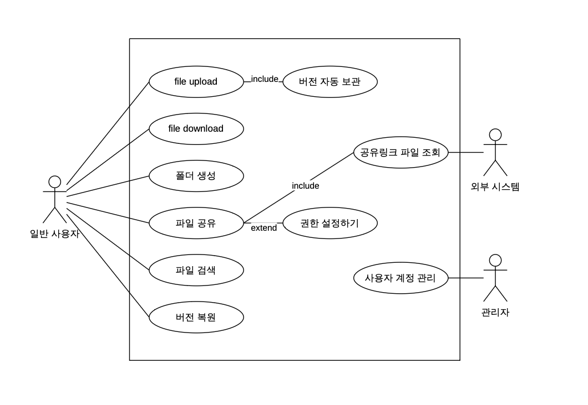
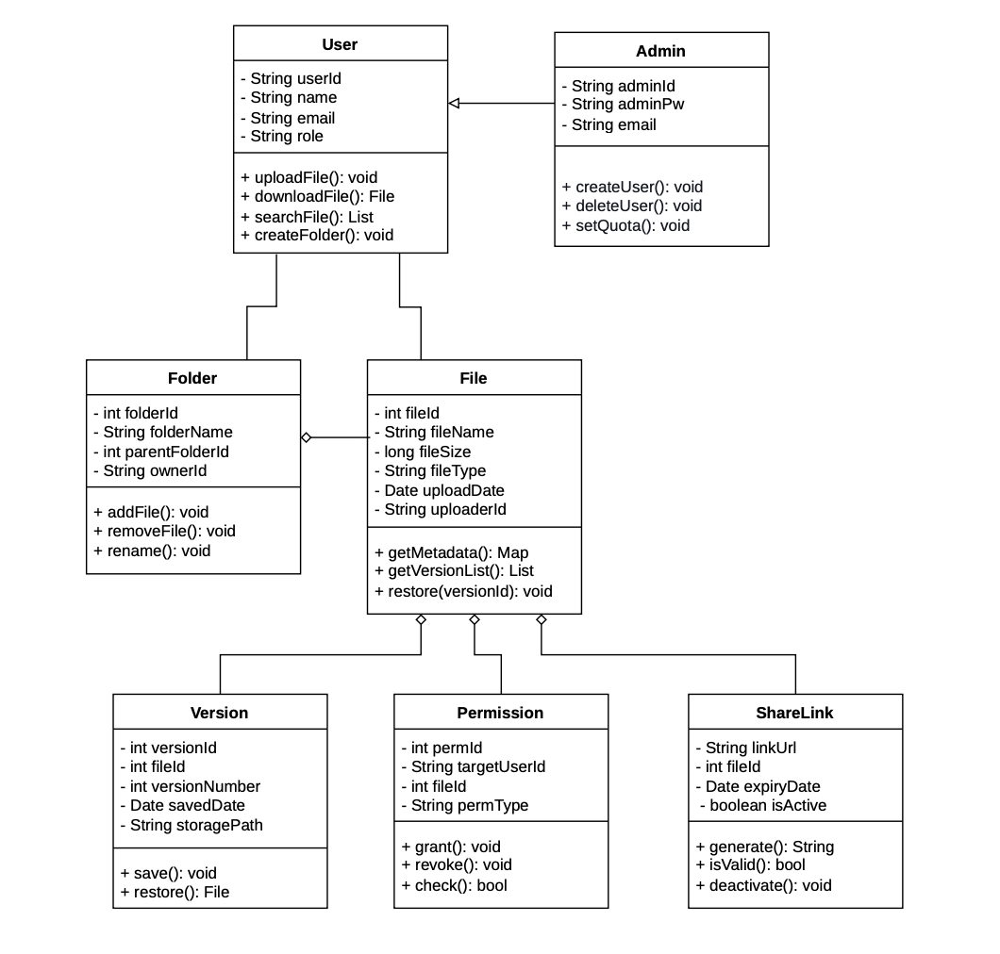
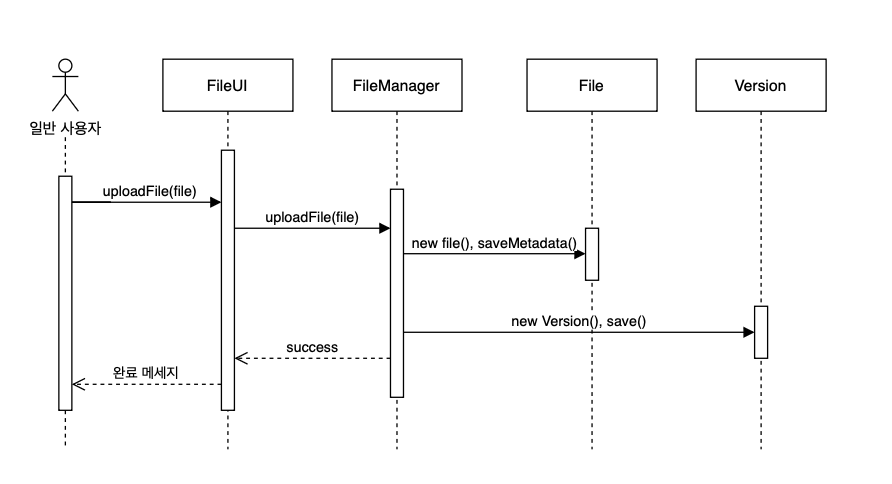
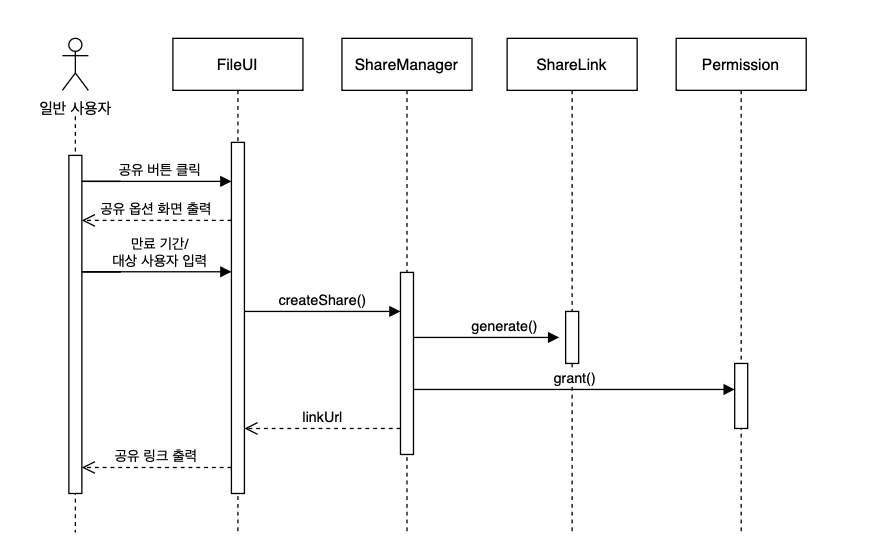
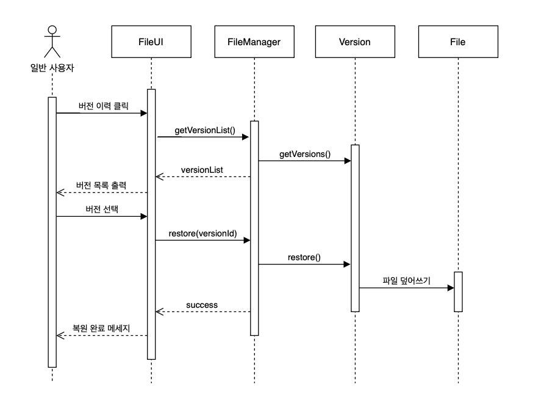
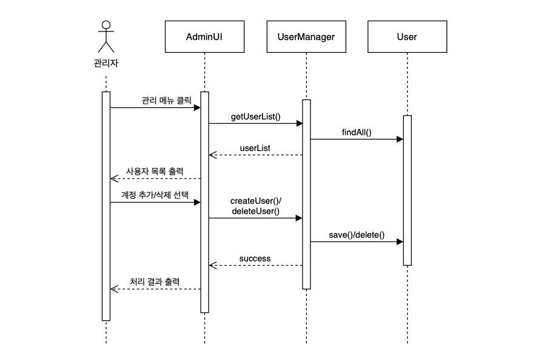

# 요구사항 분석서

**[ MiniDrive: 클라우드 기반 통합 파일 관리 시스템 ]**

---

## 제/개정 이력

| 버전 | 날짜 | 작성자 | 제/개정사항 | 비고 |
|:---:|:---:|:---:|:---:|:---:|
| 1.0 | 26.05.16 | 이윤아 | 요구사항 분석서 최초 작성 | |

---

## 목차

1. 서론
2. 시스템 개요
3. 요구사항 명세
4. 인터페이스 분석
5. 제약사항
6. 요구사항 추적표
7. 참고문헌 및 부록

---

## 1. 서론

### 1.1 목적 및 범위

본 문서는 MiniDrive 클라우드 파일 관리 시스템의 요구사항을 객체지향 분석 관점에서 정리한 요구사항 분석서이다.

기능 모델링(유스 케이스 다이어그램 및 설명서), 구조 모델링(클래스 다이어그램 및 CRC 카드), 행위 모델링(순차 다이어그램)을 포함하며, 설계 단계에 앞서 시스템의 구조와 동작을 명확히 정의하는 것을 목적으로 한다.

### 1.2 용어 정의

| 용어 | 설명 |
|:---|:---|
| 유스케이스 | 시스템이 액터에게 제공하는 기능 단위 |
| 액터 (Actor) | 시스템 외부에서 상호작용하는 사람 또는 외부 시스템 |
| CRC 카드 | 클래스의 이름, 책임, 협력 관계를 정리하는 분석 도구 |
| 순차 다이어그램 | 객체 간 메시지 교환을 시간 축 기준으로 표현한 다이어그램 |
| 버전 관리 | 파일 수정 시 이전 버전을 자동 보관하여 복원 가능하게 하는 기능 |
| 공유 링크 | 외부 사용자가 파일에 접근할 수 있는 URL (만료 기간 설정 가능) |
| RBAC | 역할 기반 접근 제어 (Role-Based Access Control) |

### 1.3 참조 문서

- 시스템정의서_260330_Doc-001
- 품질요소추정서_260402_Doc-002
- 프로젝트관리계획서_260424_Doc-003
- 요구사항정의서_260500_Doc-004

---

## 2. 시스템 개요

### 2.1 소프트웨어 컨텍스트 (Context)

#### 2.1.1 Actor Table

| Actor | Role |
|:---:|:---|
| 일반 사용자 (User) | 파일 업로드, 다운로드, 검색, 공유, 버전 복원 등 핵심 기능을 사용하는 조직 구성원 또는 외부 협력자 |
| 관리자 (Admin) | 사용자 계정 생성/삭제, 저장 공간 할당량 설정, 시스템 로그 모니터링 등 시스템 전반을 관리하는 주체 |
| 외부 시스템 (System) | 파일 공유 링크 접근 시 파일을 제공하는 파일 서버 (Secondary Actor) |

#### 2.1.2 UseCase Diagram

- **액터:** 일반 사용자 (Primary), 관리자 (Primary), 외부 시스템 (Secondary)
- **포함관계 (include):** UC-01 파일 업로드하기 → 버전 자동 보관하기
- **확장관계 (extend):** UC-04 파일 공유하기 → 권한 설정하기

### 2.2 기능 분류 및 설명

#### 2.2.1 UseCase Description

---

**Use Case Name:** 파일 업로드하기 &nbsp;&nbsp; **ID:** UC-01 &nbsp;&nbsp; **Importance Level:** High

**Primary Actor:** 일반 사용자

**Use Case Type:** Detail, Essential

**Brief Description:** 사용자가 파일을 선택하여 시스템에 업로드하고 메타데이터를 자동 기록한다.

**Stakeholders and Interests**
- 일반 사용자: 파일을 저장하고 팀원과 공유하고자 한다.

**Trigger:** 사용자가 업로드 버튼을 클릭한다.

**Relationships**
- Association: 일반 사용자
- Include: 버전 자동 보관하기
- Extend:
- Generalization:

**Normal Flow of Events:**
1. 사용자는 업로드할 파일을 선택한다.
2. 사용자는 업로드 버튼을 클릭한다.
3. 시스템은 파일을 저장하고 파일명, 날짜, 크기 등 메타데이터를 자동 기록한다.
4. 시스템은 업로드 완료 메시지를 출력하고 파일 목록을 갱신한다.

**Subflows:**
- S-1: 버전 자동 보관
  1. 동일한 파일명이 이미 존재하는 경우 이전 버전을 버전 이력에 자동 보관한다.

**Alternate / Exceptional Flows:**
- 3.a1: 저장 공간이 부족한 경우 시스템은 "저장 공간이 부족합니다." 메시지를 출력하고 업로드를 중단한다.
- 3.a2: 지원하지 않는 파일 형식인 경우 시스템은 "지원하지 않는 파일 형식입니다." 메시지를 출력한다.

---

**Use Case Name:** 파일 다운로드하기 &nbsp;&nbsp; **ID:** UC-02 &nbsp;&nbsp; **Importance Level:** High

**Primary Actor:** 일반 사용자

**Use Case Type:** Detail, Essential

**Brief Description:** 사용자가 파일 목록에서 파일을 선택하여 로컬로 다운로드한다.

**Stakeholders and Interests**
- 일반 사용자: 저장된 파일을 자신의 기기에 다운받고자 한다.

**Trigger:** 사용자가 파일을 선택하고 다운로드 버튼을 클릭한다.

**Relationships**
- Association: 일반 사용자
- Include:
- Extend:
- Generalization:

**Normal Flow of Events:**
1. 사용자는 파일 목록에서 원하는 파일을 선택한다.
2. 사용자는 다운로드 버튼을 클릭한다.
3. 시스템은 해당 사용자의 파일 접근 권한을 확인한다.
4. 시스템은 파일을 브라우저로 전송한다.

**Subflows:**

**Alternate / Exceptional Flows:**
- 3.a1: 접근 권한이 없는 경우 시스템은 "접근 권한이 없습니다." 메시지를 출력하고 다운로드를 차단한다.
- 4.a1: 파일이 존재하지 않는 경우 시스템은 "파일을 찾을 수 없습니다." 메시지를 출력한다.

---

**Use Case Name:** 폴더 생성하기 &nbsp;&nbsp; **ID:** UC-03 &nbsp;&nbsp; **Importance Level:** Medium

**Primary Actor:** 일반 사용자

**Use Case Type:** Detail, Essential

**Brief Description:** 사용자가 새 폴더를 만들어 파일을 체계적으로 분류한다.

**Stakeholders and Interests**
- 일반 사용자: 파일을 프로젝트별로 정리하고자 한다.

**Trigger:** 사용자가 새 폴더 버튼을 클릭한다.

**Relationships**
- Association: 일반 사용자
- Include:
- Extend:
- Generalization:

**Normal Flow of Events:**
1. 사용자는 새 폴더 버튼을 클릭한다.
2. 사용자는 폴더 이름을 입력한다.
3. 시스템은 같은 위치에 동일한 이름의 폴더가 있는지 확인한다.
4. 시스템은 폴더를 생성하고 목록에 반영한다.

**Subflows:**

**Alternate / Exceptional Flows:**
- 3.a1: 같은 이름의 폴더가 이미 존재하는 경우 시스템은 "같은 이름의 폴더가 이미 존재합니다." 메시지를 출력한다.
- 2.a1: 이름을 입력하지 않은 경우 시스템은 폴더 생성을 완료하지 않고 이름 입력을 요청한다.

---

**Use Case Name:** 파일 공유하기 &nbsp;&nbsp; **ID:** UC-04 &nbsp;&nbsp; **Importance Level:** High

**Primary Actor:** 일반 사용자

**Use Case Type:** Detail, Essential

**Brief Description:** 사용자가 파일에 대한 공유 링크를 생성하거나 특정 사용자에게 접근 권한을 부여한다.

**Stakeholders and Interests**
- 일반 사용자: 팀원 또는 외부 협력자에게 파일을 공유하고자 한다.

**Trigger:** 사용자가 공유 버튼을 클릭한다.

**Relationships**
- Association: 일반 사용자
- Include: 공유링크 파일 조회하기
- Extend: 권한 설정하기
- Generalization:

**Normal Flow of Events:**
1. 사용자는 공유할 파일을 선택하고 공유 버튼을 클릭한다.
2. 시스템은 공유 옵션 화면(링크 생성 / 사용자 지정)을 출력한다.
3. 사용자는 만료 기간을 설정하거나 대상 사용자를 입력한다.
4. 시스템은 공유 링크를 생성하거나 해당 사용자에게 권한을 부여한다.
5. 시스템은 공유 링크 또는 공유 완료 메시지를 출력한다.

**Subflows:**
- S-1: 권한 설정
  1. 사용자가 대상자를 선택한 경우 보기 / 수정 / 댓글 중 권한 유형을 지정한다.
  2. 시스템은 해당 권한을 대상 사용자에게 저장한다.

**Alternate / Exceptional Flows:**
- 3.a1: 존재하지 않는 사용자를 입력한 경우 시스템은 "등록되지 않은 사용자입니다." 메시지를 출력한다.
- 3.a2: 만료 기간을 설정하지 않은 경우 시스템은 기본 만료 기간(7일)을 자동 적용한다.

---

**Use Case Name:** 파일 검색하기 &nbsp;&nbsp; **ID:** UC-05 &nbsp;&nbsp; **Importance Level:** High

**Primary Actor:** 일반 사용자

**Use Case Type:** Detail, Essential

**Brief Description:** 사용자가 파일명, 업로드 날짜, 파일 유형 등 조건으로 파일을 검색한다.

**Stakeholders and Interests**
- 일반 사용자: 원하는 파일을 빠르게 찾고자 한다.

**Trigger:** 사용자가 검색창에 키워드를 입력하거나 필터를 설정한다.

**Relationships**
- Association: 일반 사용자
- Include:
- Extend:
- Generalization:

**Normal Flow of Events:**
1. 사용자는 검색창에 키워드를 입력하거나 날짜 / 파일 유형 필터를 선택한다.
2. 시스템은 조건에 맞는 파일 목록을 출력한다.
3. 사용자는 결과 목록에서 원하는 파일을 클릭한다.
4. 시스템은 해당 파일의 위치로 이동한다.

**Subflows:**

**Alternate / Exceptional Flows:**
- 2.a1: 검색 결과가 없는 경우 시스템은 "검색 결과가 없습니다." 메시지를 출력한다.

---

**Use Case Name:** 버전 복원하기 &nbsp;&nbsp; **ID:** UC-06 &nbsp;&nbsp; **Importance Level:** Medium

**Primary Actor:** 일반 사용자

**Use Case Type:** Detail, Essential

**Brief Description:** 사용자가 파일의 버전 이력을 확인하고 원하는 버전으로 복원한다.

**Stakeholders and Interests**
- 일반 사용자: 실수로 수정한 파일을 이전 상태로 되돌리고자 한다.

**Trigger:** 사용자가 파일의 버전 이력 버튼을 클릭한다.

**Relationships**
- Association: 일반 사용자
- Include:
- Extend:
- Generalization:

**Normal Flow of Events:**
1. 사용자는 파일을 선택하고 버전 이력 버튼을 클릭한다.
2. 시스템은 버전 목록을 날짜 순으로 출력한다.
3. 사용자는 복원할 버전을 선택하고 복원 버튼을 클릭한다.
4. 시스템은 해당 버전의 파일로 복원하고 현재 버전으로 표시한다.
5. 시스템은 복원 완료 메시지를 출력한다.

**Subflows:**

**Alternate / Exceptional Flows:**
- 2.a1: 버전 이력이 없는 경우 시스템은 "이전 버전이 없습니다." 메시지를 출력한다.

---

**Use Case Name:** 사용자 계정 관리하기 &nbsp;&nbsp; **ID:** UC-07 &nbsp;&nbsp; **Importance Level:** High

**Primary Actor:** 관리자

**Use Case Type:** Detail, Essential

**Brief Description:** 관리자가 사용자 계정을 생성·삭제하고 저장 공간 할당량을 설정한다.

**Stakeholders and Interests**
- 관리자: 시스템 접근 사용자를 통제하고 자원을 효율적으로 분배하고자 한다.

**Trigger:** 관리자가 사용자 관리 메뉴에 진입한다.

**Relationships**
- Association: 관리자
- Include:
- Extend:
- Generalization:

**Normal Flow of Events:**
1. 관리자는 사용자 관리 메뉴를 클릭한다.
2. 시스템은 사용자 목록과 관리 옵션(추가 / 삭제 / 할당량 설정)을 출력한다.
3. 관리자는 계정 추가 또는 삭제를 선택한다.
4. 시스템은 변경 사항을 DB에 저장하고 처리 결과를 출력한다.

**Subflows:**
- S-1: 계정 추가
  1. 관리자는 이메일, 이름, 초기 비밀번호를 입력한다.
  2. 시스템은 이메일 중복 여부를 확인하고 계정을 생성한다.
- S-2: 할당량 설정
  1. 관리자는 사용자를 선택하고 저장 공간 크기를 입력한다.
  2. 시스템은 해당 사용자의 할당량을 업데이트한다.

**Alternate / Exceptional Flows:**
- S-1.a1: 이미 등록된 이메일인 경우 시스템은 "이미 등록된 이메일입니다." 메시지를 출력한다.
- 3.a1: 존재하지 않는 계정을 삭제하려는 경우 시스템은 "존재하지 않는 사용자입니다." 메시지를 출력한다.

---

**Use Case Name:** 공유링크 파일 조회하기 &nbsp;&nbsp; **ID:** UC-08 &nbsp;&nbsp; **Importance Level:** Medium

**Primary Actor:** 외부 시스템

**Use Case Type:** Detail, Essential

**Brief Description:** 외부인이 공유 링크 URL로 접근하여 파일을 열람하거나 다운로드한다.

**Stakeholders and Interests**
- 외부 사용자: 공유받은 링크를 통해 파일을 열람하거나 다운로드하길 원한다.

**Trigger:** 외부인이 공유 링크 URL에 접속한다.

**Relationships**
- Association: 외부 시스템
- Include:
- Extend:
- Generalization:

**Normal Flow of Events:**
1. 외부인이 공유 링크 URL에 접속한다.
2. 시스템은 링크의 유효성(만료 여부, 활성화 여부)을 확인한다.
3. 시스템은 해당 파일을 열람 화면으로 출력한다.
4. 외부인은 파일을 열람하거나 다운로드한다.

**Subflows:**

**Alternate / Exceptional Flows:**
- 2.a1: 링크가 만료된 경우 시스템은 "만료된 링크입니다." 메시지를 출력한다.
- 2.a2: 링크가 비활성화된 경우 시스템은 "유효하지 않은 링크입니다." 메시지를 출력한다.

---

## 3. 요구사항 명세

### 3.1 정적 분석

MiniDrive 시스템의 주요 클래스와 클래스 간 관계를 나타낸다.

**주요 클래스 및 관계**

| 클래스명 | 설명 |
|:---|:---|
| User | 시스템을 사용하는 조직 구성원 또는 외부 협력자 |
| Admin | 시스템 전체를 관리하는 특수 권한 사용자. User를 상속 |
| File | 시스템에 저장되는 개별 파일 객체 |
| Folder | 파일을 계층적으로 분류하는 디렉토리 객체 |
| Permission | 특정 사용자에게 부여되는 파일 접근 권한 정보 |
| ShareLink | 외부 사용자가 파일에 접근할 수 있도록 생성되는 URL 객체 |
| Version | 파일이 수정될 때 자동으로 보관되는 이전 버전 객체 |

| 관계 | 설명 |
|:---|:---|
| User → File (1 : 0..*) | 사용자 한 명이 여러 파일을 소유 (연관 관계) |
| File → Version (1 : 0..*) | 파일 하나에 여러 버전이 존재 (집합 관계) |
| Folder → File (1 : 0..*) | 폴더 하나에 여러 파일이 포함 (집합 관계) |
| Admin → User | Admin은 User의 하위 클래스 (일반화 관계) |
| File → Permission (1 : 0..*) | 파일에 여러 권한 정보가 설정 (연관 관계) |
| File → ShareLink (1 : 0..*) | 파일에 여러 공유 링크가 생성 (연관 관계) |

---

### 3.2 CRC 카드

---

| Class Name: User | ID: 01 | Type: Concrete, Domain |
|:---|:---|:---|
| **Description:** 시스템을 사용하는 조직 구성원 또는 외부 협력자 | | **Associated Use Case:** UC-01, UC-02, UC-03, UC-04, UC-05, UC-06 |
| **Responsibilities** | **Collaborators** | |
| 파일 업로드하기 | File | |
| 파일 다운로드하기 | Folder | |
| 파일 검색하기 | Permission | |
| 폴더 생성하기 | ShareLink | |
| **Attributes** | | |
| - String userId | | |
| - String name | | |
| - String email | | |
| - String role | | |
| **Operations** | | |
| + uploadFile(): void | | |
| + downloadFile(): File | | |
| + searchFile(): List | | |
| + createFolder(): void | | |
| **Relationships** | | |
| Generalization (a-kind-of): - | | |
| Aggregation (has-parts): - | | |
| Other Associations: File, Folder, Permission | | |

---

| Class Name: Admin | ID: 02 | Type: Concrete, Domain |
|:---|:---|:---|
| **Description:** 시스템 전체를 관리하는 특수 권한 사용자 | | **Associated Use Case:** UC-07 |
| **Responsibilities** | **Collaborators** | |
| 사용자 계정 생성/삭제 | User | |
| 저장 공간 할당량 설정 | | |
| 시스템 로그 모니터링 | | |
| **Attributes** | | |
| - String adminId | | |
| - String adminPw | | |
| - String email | | |
| **Operations** | | |
| + createUser(info): void | | |
| + deleteUser(userId): void | | |
| + setQuota(userId, size): void | | |
| **Relationships** | | |
| Generalization (a-kind-of): User | | |
| Aggregation (has-parts): - | | |
| Other Associations: User | | |

---

| Class Name: File | ID: 03 | Type: Concrete, Domain |
|:---|:---|:---|
| **Description:** 시스템에 저장되는 개별 파일 객체 | | **Associated Use Case:** UC-01, UC-02, UC-05, UC-06 |
| **Responsibilities** | **Collaborators** | |
| 파일 메타데이터 보관 | User | |
| 버전 이력 관리 | Folder | |
| 다운로드 제공 | Version | |
| | Permission | |
| **Attributes** | | |
| - int fileId | | |
| - String fileName | | |
| - long fileSize | | |
| - String fileType | | |
| - Date uploadDate | | |
| - String uploaderId | | |
| **Operations** | | |
| + getMetadata(): Map | | |
| + getVersionList(): List | | |
| + restore(versionId): void | | |
| **Relationships** | | |
| Generalization (a-kind-of): - | | |
| Aggregation (has-parts): Version | | |
| Other Associations: User, Folder, Permission | | |

---

| Class Name: Folder | ID: 04 | Type: Concrete, Domain |
|:---|:---|:---|
| **Description:** 파일을 계층적으로 분류하는 디렉토리 객체 | | **Associated Use Case:** UC-03 |
| **Responsibilities** | **Collaborators** | |
| 파일 및 하위 폴더 보관 | User | |
| 폴더 이름 변경 및 삭제 | File | |
| **Attributes** | | |
| - int folderId | | |
| - String folderName | | |
| - int parentFolderId | | |
| - String ownerId | | |
| **Operations** | | |
| + addFile(file): void | | |
| + removeFile(file): void | | |
| + rename(name): void | | |
| **Relationships** | | |
| Generalization (a-kind-of): - | | |
| Aggregation (has-parts): File | | |
| Other Associations: User | | |

---

| Class Name: Permission | ID: 05 | Type: Concrete, Domain |
|:---|:---|:---|
| **Description:** 특정 사용자에게 부여되는 파일 접근 권한 정보 | | **Associated Use Case:** UC-04 |
| **Responsibilities** | **Collaborators** | |
| 권한 유형 관리 (보기/수정/댓글) | User | |
| 권한 부여 및 해제 | File | |
| **Attributes** | | |
| - int permId | | |
| - String targetUserId | | |
| - int fileId | | |
| - String permType | | |
| **Operations** | | |
| + grant(userId, type): void | | |
| + revoke(userId): void | | |
| + check(userId): bool | | |
| **Relationships** | | |
| Generalization (a-kind-of): - | | |
| Aggregation (has-parts): - | | |
| Other Associations: User, File | | |

---

| Class Name: ShareLink | ID: 06 | Type: Concrete, Domain |
|:---|:---|:---|
| **Description:** 외부 사용자가 파일에 접근할 수 있도록 생성되는 URL 객체 | | **Associated Use Case:** UC-04, UC-08 |
| **Responsibilities** | **Collaborators** | |
| 공유 링크 생성 | File | |
| 만료 기간 관리 | User | |
| 접근 허용 여부 확인 | | |
| **Attributes** | | |
| - String linkUrl | | |
| - int fileId | | |
| - Date expiryDate | | |
| - boolean isActive | | |
| **Operations** | | |
| + generate(fileId, expiry): String | | |
| + isValid(): bool | | |
| + deactivate(): void | | |
| **Relationships** | | |
| Generalization (a-kind-of): - | | |
| Aggregation (has-parts): - | | |
| Other Associations: File, User | | |

---

| Class Name: Version | ID: 07 | Type: Concrete, Domain |
|:---|:---|:---|
| **Description:** 파일이 수정될 때 자동으로 보관되는 이전 버전 객체 | | **Associated Use Case:** UC-06 |
| **Responsibilities** | **Collaborators** | |
| 버전 스냅샷 저장 | File | |
| 복원 기능 제공 | | |
| **Attributes** | | |
| - int versionId | | |
| - int fileId | | |
| - int versionNumber | | |
| - Date savedDate | | |
| - String storagePath | | |
| **Operations** | | |
| + save(): void | | |
| + restore(): File | | |
| **Relationships** | | |
| Generalization (a-kind-of): - | | |
| Aggregation (has-parts): - | | |
| Other Associations: File | | |

---

### 3.3 동적 분석

유스 케이스별 순차 다이어그램을 기술한다.

---

#### 3.3.1 파일 업로드하기 (UC-01)

**참여 객체:** 일반 사용자, FileUI (Boundary), FileManager (Controller), File (Entity), Version (Entity)

**메시지 흐름:**
1. 사용자는 FileUI에 파일을 선택하고 업로드를 요청한다.
2. FileUI는 FileManager에 uploadFile(file)을 호출한다.
3. FileManager는 File 객체를 생성하고 메타데이터를 저장한다.
4. FileManager는 Version 객체를 생성하여 초기 버전을 보관한다. (include)
5. FileManager는 FileUI에 success를 반환한다.
6. FileUI는 사용자에게 완료 메시지를 출력한다.

---

#### 3.3.2 파일 공유하기 (UC-04)

**참여 객체:** 일반 사용자, FileUI (Boundary), ShareManager (Controller), ShareLink (Entity), Permission (Entity)

**메시지 흐름:**
1. 사용자는 FileUI에서 파일을 선택하고 공유 버튼을 클릭한다.
2. FileUI는 공유 옵션 화면을 출력한다.
3. 사용자는 만료 기간 또는 대상 사용자를 입력한다.
4. FileUI는 ShareManager에 createShare()를 호출한다.
5. ShareManager는 ShareLink 객체를 생성한다.
6. ShareManager는 Permission에 권한을 부여한다. (extend)
7. ShareManager는 FileUI에 linkUrl을 반환한다.
8. FileUI는 사용자에게 공유 링크를 출력한다.

---

#### 3.3.3 버전 복원하기 (UC-06)

**참여 객체:** 일반 사용자, FileUI (Boundary), FileManager (Controller), File (Entity), Version (Entity)

**메시지 흐름:**
1. 사용자는 FileUI에서 파일을 선택하고 버전 이력 버튼을 클릭한다.
2. FileUI는 FileManager에 getVersionList()를 호출한다.
3. FileManager는 Version 목록을 반환한다.
4. FileUI는 버전 목록을 출력한다.
5. 사용자는 복원할 버전을 선택한다.
6. FileUI는 FileManager에 restore(versionId)를 호출한다.
7. FileManager는 Version.restore()를 실행하여 File을 복원한다.
8. FileUI는 복원 완료 메시지를 출력한다.

---

#### 3.3.4 사용자 계정 관리하기 (UC-07)

**참여 객체:** 관리자, AdminUI (Boundary), UserManager (Controller), User (Entity)

**메시지 흐름:**
1. 관리자는 AdminUI에서 사용자 관리 메뉴를 클릭한다.
2. AdminUI는 UserManager에 getUserList()를 요청한다.
3. UserManager는 User 목록을 반환한다.
4. 관리자는 계정 추가 또는 삭제를 선택한다.
5. AdminUI는 UserManager에 createUser() 또는 deleteUser()를 호출한다.
6. UserManager는 DB에 반영하고 success를 반환한다.
7. AdminUI는 관리자에게 처리 결과를 출력한다.

---

## 4. 인터페이스 분석

| 인터페이스 구분 | 대상 | 방향 | 내용 |
|:---:|:---|:---:|:---|
| 사용자 인터페이스 | 일반 사용자 / 관리자 | 양방향 | 웹 브라우저 기반 HTML/CSS/JS 화면 |
| 외부 시스템 인터페이스 | 외부 공유 링크 접근자 | 단방향 (출력) | 만료 기간 기반 공유 URL 제공 |
| 데이터베이스 인터페이스 | MySQL DB | 양방향 | 파일 메타데이터, 사용자 정보, 버전 이력 저장·조회 |
| 파일 스토리지 인터페이스 | 로컬 파일 서버 | 양방향 | 실제 파일 바이너리 저장 및 읽기 |

---

## 5. 제약사항

| 구분 | 내용 |
|:---:|:---|
| 기술 제약 | 백엔드: Python (Flask), DB: MySQL 8.0, 프론트엔드: HTML/CSS/JS |
| 성능 제약 | 200명 동시 접속 환경에서 파일 검색 응답시간 3초 이내 |
| 보안 제약 | 로그인 인증 필수, 권한 없는 파일 접근 차단, 데이터 전송 시 HTTPS 적용 |
| 환경 제약 | 웹 브라우저를 통해 접근 가능해야 하며 별도 클라이언트 설치 불필요 |
| 팀 규모 제약 | 4인 팀 기준, 12개월 이내 개발 완료 목표 |

---

## 6. 요구사항 추적표

| UC ID | 유스케이스 명 | FR ID | 정적 분석 (클래스) | 동적 분석 |
|:---:|:---|:---:|:---|:---:|
| UC-01 | 파일 업로드하기 | FR-01 | File, Version | SD-01 |
| UC-02 | 파일 다운로드하기 | FR-01 | File, Permission | SD-02 |
| UC-03 | 폴더 생성하기 | FR-02 | Folder | SD-03 |
| UC-04 | 파일 공유하기 | FR-03 | ShareLink, Permission | SD-04 |
| UC-05 | 파일 검색하기 | FR-04 | File | SD-05 |
| UC-06 | 버전 복원하기 | FR-05 | Version, File | SD-06 |
| UC-07 | 사용자 계정 관리하기 | FR-06 | Admin, User | SD-07 |
| UC-08 | 공유링크 파일 조회하기 | FR-03 | ShareLink | SD-08 |

---

## 7. 참고문헌 및 부록

### 참고문헌

- 최은만, 『소프트웨어 공학』, 생능출판사
- 시스템정의서_260330_Doc-001
- 요구사항정의서_260500_Doc-004
- ch08_객체지향 분석

### 부록

- 부록 A: 유스 케이스 다이어그램 (`/diagrams/usecase_diagram.png`)
- 부록 B: 클래스 다이어그램 (`/diagrams/class_diagram.png`)
- 부록 C: 순차 다이어그램 (`/diagrams/sd_uc01.png` ~ `sd_uc07.png`)
